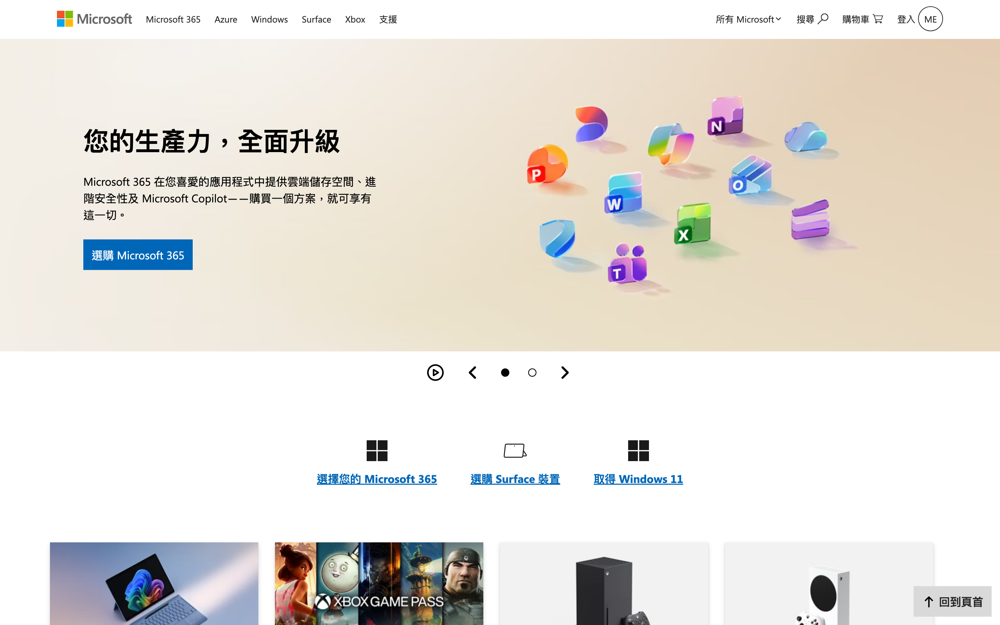

# Microsoft 台灣官網首頁 — 高擬真響應式切版

> 以 **純 HTML5 + CSS3（零 JavaScript）** 完成 [Microsoft 台灣官網首頁](https://www.microsoft.com/zh-tw) 的高擬真重刻，聚焦在響應式排版、圖片載入效能，以及「不寫 JS 也能做出完整互動」的 CSS 工程能力。

<p align="center">
  
</p>

<p align="center">
  <a href="https://edithfxx.github.io/microsoft-cut/"><b>🔗 線上 Demo</b></a>
</p>

<p align="center">
  <a href="https://edithfxx.github.io/microsoft-cut/">
    
  </a>
</p>

---

## 專案動機

這是一份刻意「限制工具」的切版練習：**全程不使用任何 JavaScript 與 CSS 框架**，只用原生 HTML/CSS 還原一個量級接近正式產品的頁面。目的是驗證幾件對前端工程師相對核心的能力：

- 在沒有框架保護傘的情況下，能不能寫出**可維護、可擴充**的 HTML 結構與 CSS 架構
- 面對真實產品的**多斷點響應式**與**多層級導覽選單**，能不能收斂成乾淨的解法
- 有沒有把**圖片載入效能**與**鍵盤可及性**當成預設要求，而不是事後才補

## 線上預覽

**Live Demo → https://edithfxx.github.io/microsoft-cut/**

本專案已透過 GitHub Pages 佈署，點擊上方連結即可直接瀏覽。若要在本機執行：

```bash
# 方式一：直接以瀏覽器開啟
open index.html

# 方式二：起一個本機伺服器（推薦，避免相對路徑問題）
npx serve .
# 或
python3 -m http.server 8000
```

## 技術棧

| 類別 | 使用技術 |
| --- | --- |
| 標記語言 | HTML5（語意化標籤 `nav` / `section` / `footer`） |
| 樣式 | 原生 CSS3（Flexbox、Grid、`@media`、`:checked` 狀態切換） |
| 圖片格式 | AVIF + `<picture>` 響應式圖源（art direction） |
| 字體 / 圖示 | Segoe UI、Font Awesome |
| 建置工具 | 無（刻意零依賴、零打包） |

## 專案結構

```
microsoft-cut/
├── index.html            # 單頁結構，語意化區塊切分
├── css/
│   ├── microsoft.css     # 主要版面與各區塊樣式（含 9 組響應式斷點）
│   ├── mobile-nav.css    # 行動版導覽（漢堡選單 / 多層下拉）
│   └── button.css        # 可重用的按鈕元件樣式
└── img/                  # 依區塊分類的圖片資源（swiper / four-card / footer …）
```

## 技術亮點

### 1. 純 CSS 互動 — 不寫一行 JavaScript
導覽列的**漢堡選單**與**多層級下拉選單**全部以「Checkbox Hack」實作：透過隱藏的 `<input type="checkbox">` 搭配 `:checked` 選擇器切換展開狀態，共管理 9 組互動開關。展現的是對 CSS 狀態機與選擇器優先級的掌握，而非直覺地丟給 JS。

### 2. 圖片載入效能 — AVIF + Art Direction
主視覺輪播圖採用 `<picture>` + `srcset` + `media`，依視窗寬度（540 / 860 / 1084 / 1400px）提供**不同裁切比例與尺寸**的圖片，並全面使用次世代 **AVIF** 格式壓縮，兼顧首屏載入速度與各裝置的視覺構圖。

### 3. 多斷點響應式版面
針對真實產品的複雜排版，設計了 **9 個以上的 `@media` 斷點**（540 / 767 / 859 / 882 / 927 / 969 / 1084 / 1120 / 1400px），確保卡片群組、導覽列與頁尾在桌機、平板、手機之間都能自然重排。

### 4. 模組化 CSS 架構
CSS 依「主版面 / 行動導覽 / 按鈕元件」拆成三個檔案，樣式以區塊命名（`.four-card`、`.three-choice`、`.big-img`、`.footer-menu`…）分組管理，並抽出 `.container-normal`、`.w-100`、`.text-gray` 等可重用工具類別，降低重複與維護成本。

### 5. 鍵盤可及性（Accessibility）
互動元素加上 `tabindex`，讓下拉選單與漢堡選單可透過鍵盤操作，在無障礙體驗上做了基本把關。

## 如果再往下做，我會補強

坦白列出目前的取捨與後續規劃，也是這份作品想呈現的工程判斷：

- 補上 `aria-*` 屬性與 `:focus-visible` 樣式，讓可及性更完整
- 導覽選單的展開／收合加入輪播自動播放，以 JS 或 CSS scroll-snap 增強互動
- 將重複的按鈕、卡片樣式抽成 CSS 變數（Design Token）與更嚴謹的命名規範（如 BEM）
- 導入 Lighthouse / axe 進行效能與無障礙量化檢測

## 關於作者

前端工程師作品集專案之一，用於展示原生 HTML/CSS 的切版與工程能力。
